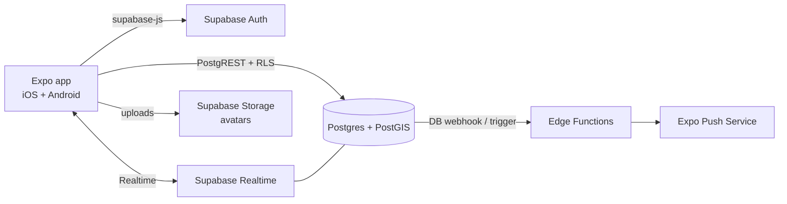

# Architecture overview

> Status: initial sketch. Update this file whenever an ADR changes the shape of the system.

## System



- The **app talks to Supabase directly**. We don't build our own API server. Authorisation is enforced by Row Level Security (RLS) policies in Postgres.
- **Edge Functions** handle server-only work: sending push notifications, moderation hooks, and anything that needs secrets.
- **Realtime** delivers new chat messages and changes to Kilos as they happen.

## Core data model (draft — finalise via feature specs)

```
profiles          (id = auth.users.id, display_name, avatar_url, sports[], bio, created_at)
kilos             (id, host_id → profiles, sport, title, description,
                   starts_at timestamptz, meeting_point geography(Point), meeting_point_label,
                   distance_m, pace_min, pace_max, no_drop bool,
                   capacity, status, created_at)
kilo_participants  (kilo_id, athlete_id, joined_at, role: host|participant)   PK(kilo_id, athlete_id)
kilo_messages      (id, kilo_id, author_id, body, created_at)
blocks            (blocker_id, blocked_id)
reports           (id, reporter_id, target_type, target_id, reason, created_at)
```

Key RLS rules (sketch):
- Anyone signed in can read `open` Kilos, except Kilos hosted by someone they've blocked or who has blocked them.
- Only the host can update or cancel their Kilo.
- Only participants can read and write a Kilo's `kilo_messages`.

## Mobile app (`apps/mobile`)

Expo with Expo Router, TypeScript strict (ADR 0001). Folder layout follows Expo's [recommended structure](https://expo.dev/blog/expo-app-folder-structure-best-practices):

```
src/
  app/          routes only — every file is a route; _layout.tsx defines navigators
  screens/      screen bodies that routes render
  components/   reusable UI (kebab-case files, one named export each)
  hooks/        reusable hooks
  utils/        standalone helpers (formatting, unit conversion); tests sit next to them
  data/         domain types and, for now, placeholder data
  theme/        design tokens (ADR 0006)
```

- **Routes stay thin.** A route file deals with URL concerns: it reads params (e.g. `useKiloParam` for `[id]`), handles "not found", and renders a screen from `src/screens/`, passing the resolved data down as props. Screens don't read URL params themselves, so they're easy to reuse and test.
- **Navigation:** a `(tabs)` group (Explore, My Kilos, Profile) with a custom `tab-bar`, and stack screens under `kilos/` (`new`, `[id]`, `[id]/chat`, `[id]/joined`).
- **Styling (ADR 0006):** `StyleSheet.create` at the bottom of each file, with colours, fonts, radii, `screenGutter` and `iconStroke` taken from `@/theme`. There's no UI kit and no Tailwind. Inter is loaded in the root layout, and icons come from Lucide.
- **Data:** screens currently read `src/data/placeholder.ts`. As each roadmap phase lands, its screens switch to Supabase queries, and `src/data/types.ts` gives way to the generated Supabase types. Chat moves to `kilo_messages` + Realtime (ADR 0004).
- **Units:** the domain types use metres, seconds and ISO/UTC timestamps. `utils/format.ts` is the only place that converts them for display (km, local time).

## Repo layout (ADR 0003)

```
apps/mobile/        Expo app
supabase/           migrations, seed.sql, edge functions, config
packages/           shared TS packages, only once there's a real second consumer
docs/
```
