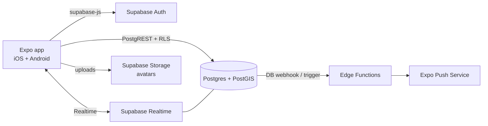

# Architecture overview

> Status: initial sketch. Update this file whenever an ADR changes the shape of the system.

## System



- The **app talks to Supabase directly**. We don't build our own API server. Authorisation is enforced by Row Level Security (RLS) policies in Postgres.
- **Edge Functions** handle server-only work: sending push notifications, moderation hooks, and anything that needs secrets.
- **Realtime** delivers new chat messages and changes to Kilos as they happen.

## Core data model (draft — finalise via feature specs)

```
profiles          (id = auth.users.id, display_name, avatar_url, sports[], bio, created_at)
kilos             (id, host_id → profiles, sport, title, description,
                   starts_at timestamptz, meeting_point geography(Point), meeting_point_label,
                   distance_m, pace_min, pace_max, no_drop bool,
                   capacity, status, created_at)
kilo_participants  (kilo_id, athlete_id, joined_at, role: host|participant)   PK(kilo_id, athlete_id)
kilo_messages      (id, kilo_id, author_id, body, created_at)
blocks            (blocker_id, blocked_id)
reports           (id, reporter_id, target_type, target_id, reason, created_at)
```

Key RLS rules (sketch):
- Anyone signed in can read `open` Kilos, except Kilos hosted by someone they've blocked or who has blocked them.
- Only the host can update or cancel their Kilo.
- Only participants can read and write a Kilo's `kilo_messages`.

## Repo layout (ADR 0003)

```
apps/mobile/        Expo app
supabase/           migrations, seed.sql, edge functions, config
packages/           shared TS packages, only once there's a real second consumer
docs/
```
